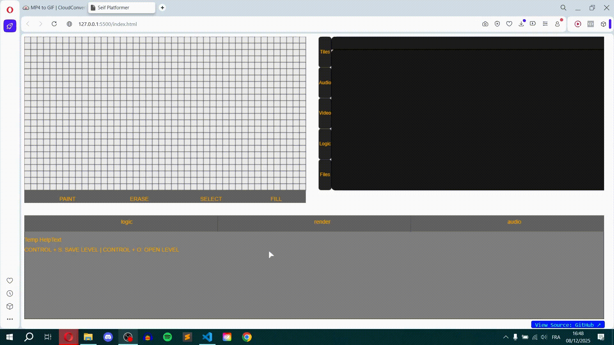
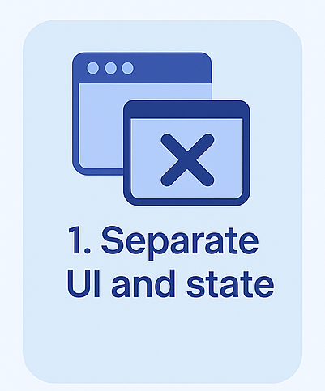
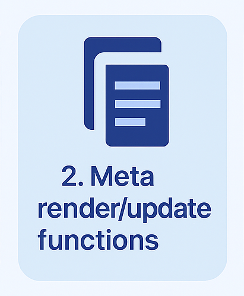
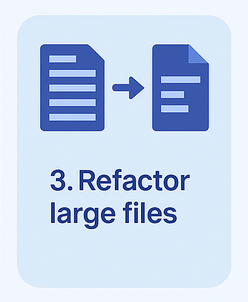
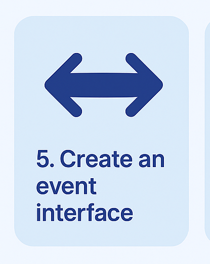
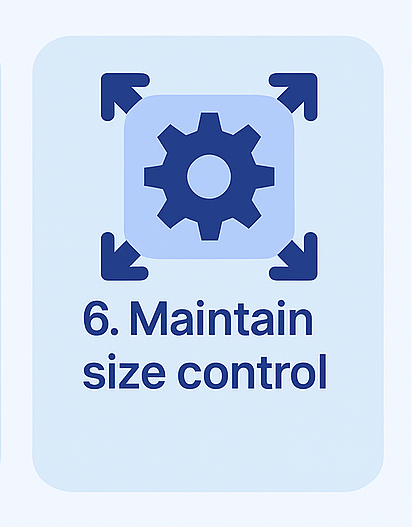
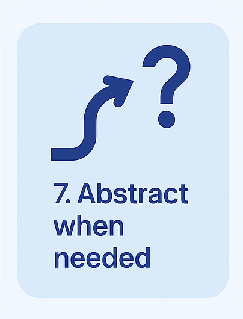
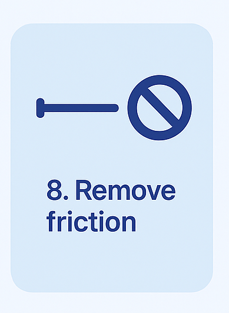

# Seif Platformer — 2D Game Editor & Engine

## 1. Overview

Seif Platformer is a fully custom 2D editor and engine built from scratch in JavaScript.
It pairs a clean update/render pipeline with a multi-panel interface that lets you paint levels,
manage tilesets, import assets, and extend functionality through metadata.

The project is not just a level editor, it is a growing toolchain.
Its architecture mirrors real engines: modular folders, explicit responsibility zones,
and systems designed to scale without friction as new tools, pages, and features emerge.

---

## 2. Features

Editor

Tile-based world painting (paint, erase, select, fill)

Dynamic tile palette that auto-scales to any atlas

Custom grid renderer with snapping, hover states, and selection feedback

Full update/render separation across every panel

Multi-panel workspace (Viewport, Right Panel, Bottom Dock)

Custom cursor system inside and outside the grid

Live level data stored in a unified runtime state (R)

Audio

Audio asset library with real-time list view

Drag-and-drop importing with file-type detection and duration parsing

Asset selection with metadata display

Planned: waveform rendering, scrubbing, card mode, and editing tools

Architecture Highlights

Metadata-driven page system (Tiles, Audio, Logic, Entities, Files)

Entry-point architecture — each subsystem exposes a clean index.js

Single runtime state (R) shared predictably across all domains

Russian-doll composition: panels → containers → components → widgets

Responsibility-based folder layout (core/, viewport/, rightPanel/)

Modular update/render lifecycle for deterministic scaling


---

## 3. 🌐 Live Demo  
👉 https://seifpetit.github.io/seif-platformer  

A visual tour of the editor in action.
These short demos highlight painting tools, asset importing, and the custom modal system.

🎨 Tile Painting & Grid Interaction

Real-time painting, erasing, selecting, filling, and hover previews.


📁 Drag-and-Drop Asset Importing

Import audio and other assets directly from the file system with instant UI updates.


💻 Modal Window System

Custom draggable modal windows with fade-in overlays, input blocking, and event routing.
This shows the engine’s internal UI framework in action.


---

## 4. 📁 Folder Structure

src/

core/ ← runtime, orchestrator, input, loader

editor/

rightPanel/ ← books, pages, metadata-driven UI

viewport/ ← grid, painting tools, world renderer

bottomDock/ ← inspector, toolbars, timeline (future)

assets/ ← tile atlases, cursors, audio

levels/ ← JSON level files

services/ ← Toaster + ModalWindow

Each folder represents a clear responsibility zone:  
**core** for engine logic, **editor** for all UI panels, **assets** for raw data, and **levels** for game content.  
The structure grows cleanly as the engine expands.

---

## 5. ▶️ How to Run

```sh
npm install
npm run dev

```

Each folder represents a clear responsibility zone:  
**core** for engine logic, **editor** for all UI panels, **assets** for raw data, and **levels** for game content.  
The structure grows cleanly as the engine expands.

---

This launches a local development server.
The editor will hot-reload as you make changes, allowing for rapid iteration.

## 6. 🧠 Architecture Overview

The engine is built around a small set of principles that keep the system predictable and scalable:

• Unified Runtime (R)

A single state object shared across all panels and subsystems.
No duplication, no drift — every interaction flows through one source of truth.

• Update/Render Lifecycle

Every component exposes:

update();
render(g);


This gives the editor a frame-based pipeline similar to real engines (Godot, Unity, custom C++ tools).

• Entry-Point Architecture

Each subsystem (core/, viewport/, rightPanel/) has an index.js that acts as its public API.
This keeps communication shallow and makes refactoring painless.

• Metadata-Driven Pages

Books and pages are defined in configuration, not hardcoded.
Adding a new page (Tiles, Audio, Entities, Logic…) requires zero UI wiring —
the system instantiates and routes page logic automatically.

• Russian-Doll Composition

Panels → containers → components → widgets.
Small self-contained pieces that update and render themselves.
The editor grows like layers of clean, predictable nesting.

---

## 7. The Doctrine of the Engine

Eight Laws. One Architecture. Infinite Growth.

These laws weren’t invented upfront.
They emerged naturally from watching the system grow, collide, break, improve, and stabilize.

They are part engineering, part sociology, part psychology.
A system is like a small society:
every module has a role, a boundary, a way it speaks, and a way it stays sane.

These laws describe that society.

### ⭐ Law I — The Update/Render Split

<p align="center">
  
</p>


“Thought and appearance must never collide.”

In human terms:
Thinking and performing at the same time causes mistakes.
So the engine separates them.

update() is the mind — decisions, logic, state.
render() is the body — appearance, visuals.

When every object follows this separation,
the whole system becomes calmer, predictable, and bug-resistant.
It’s like giving every component its own prefrontal cortex.


### ⭐ Law II — Russian-Doll Composition

<p align="center">
  
</p>


“Big things are built from small things that behave the same.”

The editor is not a monolith.
It is a stack of small societies:

Panels contain containers

Containers contain components

Components contain widgets

Like nested Russian dolls, each has the same contract:
they update themselves, render themselves, and never overstep their role.

This makes scaling effortless — the system grows by adding another doll, not rewriting the old ones.

### ⭐ Law III — The 250-Line Law

<p align="center">
  
</p>


“When a file grows too big, it wants to become two things.”

Code, like societies, becomes unstable when a single person has too many jobs.
A file passing ~250 lines is a signal:
it’s not doing one thing anymore.

Splitting the file redistributes responsibility —
and complexity evaporates.

This simple rule keeps the entire engine breathable.

### ⭐ Law IV — Responsibility Zones

<p align="center">
  
</p>

“Code that thinks together should live together.”

A society collapses when responsibilities are scattered.

core/ → engine truth

viewport/ → world interaction

rightPanel/ → UI books & pages

bottomDock/ → tools & timeline

Each zone has an identity.
No drifting, no guessing, no random folders doing random jobs.

It’s like a city map where every district has a purpose.

### ⭐ Law V — One-Level Communication

<p align="center">
  
</p>

“A child speaks to its parent — not the entire village.”

This is the strongest social law — and the one that keeps the system sane.

A page does not talk to distant modules.
A widget does not reach horizontally into other widgets.

Everything communicates one level up or down:

Widget → Component → Container → Panel → Runtime

This prevents chaos.
No telephone wires crossing every direction.
No code hunting.

It’s social hierarchy as a debugging model.

### ⭐ Law VI — Entry-Point Architecture

<p align="center">
  
</p>

“Every domain should speak with one clean voice.”

Each subsystem has an index.js that acts like a spokesperson.

You don’t import deep internals everywhere.
You talk to the entry-point, and it orchestrates the rest.

Domains stay modular.
Refactors stay painless.
And nothing leaks outside its own world.

### ⭐ Law VII — Metadata-Driven Pages

<p align="center">
  
</p>

“Describe the system in data, and the system builds itself.”

UI shouldn’t be hardcoded.
Instead, the editor reads a config file and builds its own navigation:

Tiles → Palette
Audio → Assets Page
Entities → etc

One line in PAGES.js instantly creates:

a button

a route

a page instance

layout logic

It’s basically plug-and-play UI.
The engine becomes extendable without touching code.

### ⭐ Law VIII — The Single-State Law

<p align="center">
  
</p>

“All truth lives in one place.”

Instead of scattering state across components,
the entire engine observes a unified runtime object: R.

Panels don’t store their own truth.
Pages don’t own reality.
Everything reflects the state — nothing duplicates it.

This makes future systems possible:

undo/redo

timeline scrubbing

deterministic replay

saving/loading editor sessions

One state to rule them all.

---

## 8. 🗺️ Roadmap

The editor already has a strong architectural foundation.  
These are the next steps planned for the engine:

- **Waveform Preview**  
  Real-time audio waveform rendering with scrubbing and zoom.

- **Card View for Audio**  
  Visual audio cards showing mini-waveforms, duration, and rename actions.

- **Audio Pattern Page**  
  Step sequencer + pattern editor (similar to trackers / DAWs).

- **Logic Graph Editor**  
  Node-based triggers, conditions, events, and behaviors.

- **Entity Editor**  
  Define NPCs, enemies, states, animations, attributes.

- **Timeline / Sequencer**  
  Future bottom-dock feature for cutscenes, events, and timelines.

- **Export Pipeline**  
  Export levels, assets, and metadata for integration into a runtime.

- **Undo/Redo System**  
  Enabled by the unified runtime state model (`R`).

- **Plugin System**  
  Add new pages and tools using metadata without touching core code.


---

## 9. ✍️ Author Note

This engine started as an experiment and slowly became a real tool.  
Every panel, rule, and system was shaped by necessity, not theory.  
It's still evolving, still learning, still growing.  

If you're exploring the codebase, I hope you feel the same clarity and freedom  
that drove its design: small pieces, clean boundaries, and an architecture  
that opens up instead of boxing you in.

More to come.  
Thanks for reading.


