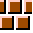
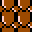
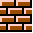
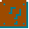
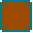
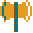
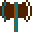
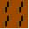

# 🎨 Tileset Reference

> Tileset: `tile_sheet.png`  
> Grid size: **16×16 px**  
> Columns: **33** Rows: **28**  
> Generated: *(add date)*  

## 🧱 Ground Blocks

> Tileset: `tile_sheet.png` • Cell size: **20×20**  
> Below are all ground variations you provided, with previews and IDs.

| Preview | ID (`id(col,row)`) | Filename |
|:--:|:--|:--|
|  | `id(0,0)` → **1** | `tile_001_c0_r0.png` |
|  | `id(0,1)` → **30** | `tile_030_c0_r1.png` |
|  | `id(0,2)` → **59** | `tile_059_c0_r2.png` |
|  | `id(0,3)` → **88** | `tile_088_c0_r3.png` |
|  | `id(0,4)` → **117** | `tile_117_c0_r4.png` |
|  | `id(0,5)` → **146** | `tile_146_c0_r5.png` |
|  | `id(0,6)` → **175** | `tile_175_c0_r6.png` |
|  | `id(0,7)` → **204** | `tile_204_c0_r7.png` |
|  | `id(1,0)` → **2** | `tile_002_c1_r0.png` |
|  | `id(1,1)` → **31** | `tile_031_c1_r1.png` |
|  | `id(1,2)` → **60** | `tile_060_c1_r2.png` |
|  | `id(1,3)` → **89** | `tile_089_c1_r3.png` |
|  | `id(1,4)` → **118** | `tile_118_c1_r4.png` |
|  | `id(1,5)` → **147** | `tile_147_c1_r5.png` |
|  | `id(1,6)` → **176** | `tile_176_c1_r6.png` |
|  | `id(1,7)` → **205** | `tile_205_c1_r7.png` |
|  | `id(2,0)` → **3** | `tile_003_c2_r0.png` |
|  | `id(2,1)` → **32** | `tile_032_c2_r1.png` |
|  | `id(2,2)` → **61** | `tile_061_c2_r2.png` |
|  | `id(2,3)` → **90** | `tile_090_c2_r3.png` |
|  | `id(2,4)` → **119** | `tile_119_c2_r4.png` |
|  | `id(2,5)` → **148** | `tile_148_c2_r5.png` |
|  | `id(2,6)` → **177** | `tile_177_c2_r6.png` |
|  | `id(2,7)` → **206** | `tile_206_c2_r7.png` |
|  | `id(3,0)` → **4** | `tile_004_c3_r0.png` |
|  | `id(3,2)` → **62** | `tile_062_c3_r2.png` |
|  | `id(3,4)` → **120** | `tile_120_c3_r4.png` |
|  | `id(3,6)` → **178** | `tile_178_c3_r6.png` |
|  | `id(11,0)` → **12** | `tile_012_c11_r0.png` |
|  | `id(11,1)` → **41** | `tile_041_c11_r1.png` |
|  | `id(11,2)` → **70** | `tile_070_c11_r2.png` |
|  | `id(11,3)` → **99** | `tile_099_c11_r3.png` |
|  | `id(11,4)` → **128** | `tile_128_c11_r4.png` |
|  | `id(11,5)` → **157** | `tile_157_c11_r5.png` |
|  | `id(11,6)` → **186** | `tile_186_c11_r6.png` |
|  | `id(11,7)` → **215** | `tile_215_c11_r7.png` |
|  | `id(13,0)` → **14** | `tile_014_c13_r0.png` |
|  | `id(13,2)` → **72** | `tile_072_c13_r2.png` |
|  | `id(13,4)` → **130** | `tile_130_c13_r4.png` |
|  | `id(13,6)` → **188** | `tile_188_c13_r6.png` |
|  | `id(15,0)` → **16** | `tile_016_c15_r0.png` |
|  | `id(15,1)` → **45** | `tile_045_c15_r1.png` |
|  | `id(15,2)` → **74** | `tile_074_c15_r2.png` |
|  | `id(15,3)` → **103** | `tile_103_c15_r3.png` |
|  | `id(15,4)` → **132** | `tile_132_c15_r4.png` |
|  | `id(15,5)` → **161** | `tile_161_c15_r5.png` |
|  | `id(15,6)` → **190** | `tile_190_c15_r6.png` |
|  | `id(15,7)` → **219** | `tile_219_c15_r7.png` |
|  | `id(16,1)` → **46** | `tile_046_c16_r1.png` |
|  | `id(16,3)` → **104** | `tile_104_c16_r3.png` |
|  | `id(16,5)` → **162** | `tile_162_c16_r5.png` |
|  | `id(16,7)` → **220** | `tile_220_c16_r7.png` |
|  | `id(17,0)` → **18** | `tile_018_c17_r0.png` |
|  | `id(17,2)` → **76** | `tile_076_c17_r2.png` |
|  | `id(17,4)` → **134** | `tile_134_c17_r4.png` |
|  | `id(17,6)` → **192** | `tile_192_c17_r6.png` |
|  | `id(18,0)` → **19** | `tile_019_c18_r0.png` |
|  | `id(18,2)` → **77** | `tile_077_c18_r2.png` |
|  | `id(18,4)` → **135** | `tile_135_c18_r4.png` |
|  | `id(18,6)` → **193** | `tile_193_c18_r6.png` |
|  | `id(19,0)` → **20** | `tile_020_c19_r0.png` |
|  | `id(19,1)` → **49** | `tile_049_c19_r1.png` |
|  | `id(19,2)` → **78** | `tile_078_c19_r2.png` |
|  | `id(19,3)` → **107** | `tile_107_c19_r3.png` |
|  | `id(19,4)` → **136** | `tile_136_c19_r4.png` |
|  | `id(19,5)` → **165** | `tile_165_c19_r5.png` |
|  | `id(19,6)` → **194** | `tile_194_c19_r6.png` |
|  | `id(19,7)` → **223** | `tile_223_c19_r7.png` |
|  | `id(21,0)` → **22** | `tile_022_c21_r0.png` |
|  | `id(21,2)` → **80** | `tile_080_c21_r2.png` |
|  | `id(21,4)` → **138** | `tile_138_c21_r4.png` |
|  | `id(21,6)` → **196** | `tile_196_c21_r6.png` |

---

## 💰 Coins & Question Boxes

> Tileset: `tile_sheet.png` • Cell size: **20×20**  
> Includes all coin and question-box related tiles.

| Preview | ID (`id(col,row)`) | Filename |
|:--:|:--|:--|
|  | `id(23,0)` → **24** | `tile_024_c23_r0.png` |
|  | `id(24,0)` → **25** | `tile_025_c24_r0.png` |
|  | `id(25,0)` → **26** | `tile_026_c25_r0.png` |
|  | `id(26,0)` → **27** | `tile_027_c26_r0.png` |
|  | `id(23,1)` → **53** | `tile_053_c23_r1.png` |
|  | `id(24,1)` → **54** | `tile_054_c24_r1.png` |
|  | `id(25,1)` → **55** | `tile_055_c25_r1.png` |
|  | `id(23,2)` → **82** | `tile_082_c23_r2.png` |
|  | `id(24,2)` → **83** | `tile_083_c24_r2.png` |
|  | `id(25,2)` → **84** | `tile_084_c25_r2.png` |
|  | `id(26,2)` → **85** | `tile_085_c26_r2.png` |
|  | `id(23,3)` → **111** | `tile_111_c23_r3.png` |
|  | `id(24,3)` → **112** | `tile_112_c24_r3.png` |
|  | `id(25,3)` → **113** | `tile_113_c25_r3.png` |
|  | `id(23,4)` → **140** | `tile_140_c23_r4.png` |
|  | `id(24,4)` → **141** | `tile_141_c24_r4.png` |
|  | `id(25,4)` → **142** | `tile_142_c25_r4.png` |
|  | `id(26,4)` → **143** | `tile_143_c26_r4.png` |
|  | `id(23,5)` → **169** | `tile_169_c23_r5.png` |
|  | `id(24,5)` → **170** | `tile_170_c24_r5.png` |
|  | `id(25,5)` → **171** | `tile_171_c25_r5.png` |
|  | `id(23,6)` → **198** | `tile_198_c23_r6.png` |
|  | `id(24,6)` → **199** | `tile_199_c24_r6.png` |
|  | `id(25,6)` → **200** | `tile_200_c25_r6.png` |
|  | `id(26,6)` → **201** | `tile_201_c26_r6.png` |
|  | `id(23,7)` → **227** | `tile_227_c23_r7.png` |
|  | `id(24,7)` → **228** | `tile_228_c24_r7.png` |
|  | `id(25,7)` → **229** | `tile_229_c25_r7.png` |

---

## 🎁 Other Collectibles

> Tileset: `tile_sheet.png` • Cell size: **20×20**  
> Includes gems, stars, power-ups, and other collectible icons.

| Preview | ID (`id(col,row)`) | Filename |
|:--:|:--|:--|
|  | `id(26,1)` → **56** | `tile_056_c26_r1.png` |
|  | `id(27,1)` → **57** | `tile_057_c27_r1.png` |
|  | `id(28,1)` → **58** | `tile_058_c28_r1.png` |
|  | `id(26,3)` → **114** | `tile_114_c26_r3.png` |
|  | `id(27,3)` → **115** | `tile_115_c27_r3.png` |
|  | `id(28,3)` → **116** | `tile_116_c28_r3.png` |
|  | `id(26,5)` → **172** | `tile_172_c26_r5.png` |
|  | `id(27,5)` → **173** | `tile_173_c27_r5.png` |
|  | `id(28,5)` → **174** | `tile_174_c28_r5.png` |
|  | `id(26,7)` → **230** | `tile_230_c26_r7.png` |
|  | `id(27,7)` → **231** | `tile_231_c27_r7.png` |
|  | `id(28,7)` → **232** | `tile_232_c28_r7.png` |
|  | `id(25,8)` → **258** | `tile_258_c25_r8.png` |
|  | `id(26,8)` → **259** | `tile_259_c26_r8.png` |
|  | `id(27,8)` → **260** | `tile_260_c27_r8.png` |
|  | `id(25,9)` → **287** | `tile_287_c25_r9.png` |
|  | `id(26,9)` → **288** | `tile_288_c26_r9.png` |
|  | `id(27,9)` → **289** | `tile_289_c27_r9.png` |
|  | `id(25,10)` → **316** | `tile_316_c25_r10.png` |
|  | `id(26,10)` → **317** | `tile_317_c26_r10.png` |
|  | `id(27,10)` → **318** | `tile_318_c27_r10.png` |
|  | `id(28,10)` → **319** | `tile_319_c28_r10.png` |
|  | `id(25,11)` → **345** | `tile_345_c25_r11.png` |
|  | `id(26,11)` → **346** | `tile_346_c26_r11.png` |
|  | `id(27,11)` → **347** | `tile_347_c27_r11.png` |
|  | `id(28,11)` → **348** | `tile_348_c28_r11.png` |
|  | `id(25,12)` → **374** | `tile_374_c25_r12.png` |
|  | `id(26,12)` → **375** | `tile_375_c26_r12.png` |
|  | `id(27,12)` → **376** | `tile_376_c27_r12.png` |
|  | `id(25,13)` → **403** | `tile_403_c25_r13.png` |
|  | `id(26,13)` → **404** | `tile_404_c26_r13.png` |
|  | `id(27,13)` → **405** | `tile_405_c27_r13.png` |
|  | `id(25,14)` → **432** | `tile_432_c25_r14.png` |
|  | `id(26,14)` → **433** | `tile_433_c26_r14.png` |
|  | `id(27,14)` → **434** | `tile_434_c27_r14.png` |
|  | `id(28,14)` → **435** | `tile_435_c28_r14.png` |
|  | `id(25,15)` → **461** | `tile_461_c25_r15.png` |
|  | `id(26,15)` → **462** | `tile_462_c26_r15.png` |
|  | `id(27,15)` → **463** | `tile_463_c27_r15.png` |
|  | `id(28,15)` → **464** | `tile_464_c28_r15.png` |
|  | `id(25,16)` → **490** | `tile_490_c25_r16.png` |
|  | `id(26,16)` → **491** | `tile_491_c26_r16.png` |
|  | `id(27,16)` → **492** | `tile_492_c27_r16.png` |
|  | `id(25,17)` → **519** | `tile_519_c25_r17.png` |
|  | `id(26,17)` → **520** | `tile_520_c26_r17.png` |
|  | `id(27,17)` → **521** | `tile_521_c27_r17.png` |
|  | `id(25,18)` → **548** | `tile_548_c25_r18.png` |
|  | `id(26,18)` → **549** | `tile_549_c26_r18.png` |
|  | `id(27,18)` → **550** | `tile_550_c27_r18.png` |
|  | `id(28,18)` → **551** | `tile_551_c28_r18.png` |
|  | `id(25,19)` → **577** | `tile_577_c25_r19.png` |
|  | `id(26,19)` → **578** | `tile_578_c26_r19.png` |
|  | `id(27,19)` → **579** | `tile_579_c27_r19.png` |
|  | `id(28,19)` → **580** | `tile_580_c28_r19.png` |
|  | `id(25,20)` → **606** | `tile_606_c25_r20.png` |
|  | `id(26,20)` → **607** | `tile_607_c26_r20.png` |
|  | `id(27,20)` → **608** | `tile_608_c27_r20.png` |
|  | `id(25,21)` → **635** | `tile_635_c25_r21.png` |
|  | `id(26,21)` → **636** | `tile_636_c26_r21.png` |
|  | `id(27,21)` → **637** | `tile_637_c27_r21.png` |
|  | `id(25,22)` → **664** | `tile_664_c25_r22.png` |
|  | `id(26,22)` → **665** | `tile_665_c26_r22.png` |
|  | `id(27,22)` → **666** | `tile_666_c27_r22.png` |
|  | `id(28,22)` → **667** | `tile_667_c28_r22.png` |
|  | `id(25,23)` → **693** | `tile_693_c25_r23.png` |
|  | `id(26,23)` → **694** | `tile_694_c26_r23.png` |
|  | `id(27,23)` → **695** | `tile_695_c27_r23.png` |
|  | `id(28,23)` → **696** | `tile_696_c28_r23.png` |

---

## 👾 Entities

> Tileset: `tile_sheet.png` • Cell size: **16×16**  
> Use these for dynamic actors (enemies, NPCs, pickups with behavior, etc.).

| Preview | ID (`id(col,row)`) | Filename |
|:--:|:--|:--|
|  | `id(16,0)` → **17** | `tile_017_c16_r0.png` |
|  | `id(16,2)` → **75** | `tile_075_c16_r2.png` |
|  | `id(16,4)` → **133** | `tile_133_c16_r4.png` |
|  | `id(16,6)` → **191** | `tile_191_c16_r6.png` |
|  | `id(17,9)` → **279** | `tile_279_c17_r9.png` |
|  | `id(17,11)` → **337** | `tile_337_c17_r11.png` |
|  | `id(17,13)` → **395** | `tile_395_c17_r13.png` |
|  | `id(17,15)` → **453** | `tile_453_c17_r15.png` |
|  | `id(17,17)` → **511** | `tile_511_c17_r17.png` |
|  | `id(17,19)` → **569** | `tile_569_c17_r19.png` |
|  | `id(18,1)` → **48** | `tile_048_c18_r1.png` |
|  | `id(18,3)` → **106** | `tile_106_c18_r3.png` |
|  | `id(18,5)` → **164** | `tile_164_c18_r5.png` |
|  | `id(18,7)` → **222** | `tile_222_c18_r7.png` |
|  | `id(18,8)` → **251** | `tile_251_c18_r8.png` |
|  | `id(18,10)` → **309** | `tile_309_c18_r10.png` |
|  | `id(18,12)` → **367** | `tile_367_c18_r12.png` |
|  | `id(18,14)` → **425** | `tile_425_c18_r14.png` |
|  | `id(18,16)` → **483** | `tile_483_c18_r16.png` |
|  | `id(18,18)` → **541** | `tile_541_c18_r18.png` |

---
## 🚰 Pipes (Blueprint Layout)

> Tileset: `tile_sheet.png` • Cell: **16×16** • Preview scale: **64px**  
> Tip: Middle tiles can repeat to extend length.

---

## 🧱 2×2 Pipes (Vertical) — All Colors

> Cell: **16×16** • Preview: **64 px** • Each set of 4 tiles = one color.

  <!-- Variant 1 (rows 8–9) -->
  

    

      
      
    

    

      
      
    

    
Top 233-234 • Bottom 262-263

  

  <!-- Variant 2 (rows 10–11) -->
  

    

      
      
    

    

      
      
    

    
Top 291-292 • Bottom 320-321

  

  <!-- Variant 3 (rows 12–13) -->
  

    

      
      
    

    

      
      
    

    
Top 349-350 • Bottom 378-379

  

  <!-- Variant 4 (rows 14–15) -->
  

    

      
      
    

    

      
      
    

    
Top 407-408 • Bottom 436-437

  

  <!-- Variant 5 (rows 16–17) -->
  

    

      
      
    

    

      
      
    

    
Top 465-466 • Bottom 494-495

  

  <!-- Variant 6 (rows 18–19) -->
  

    

      
      
    

    

      
      
    

    
Top 523-524 • Bottom 552-553

  

---

## 🚰 3×2 Pipes (Horizontal) — All Colors

> Cell: **16×16** • Preview: **64 px** • Middle tiles repeat for longer pipes.

  <!-- Variant A (rows 8 & 9) -->
  

    

      
      
      
    

    

      
      
      
    

    
Top 235–236–237 • Bottom 264–265–266

  

  <!-- Variant B (rows 10 & 11) -->
  

    

      
      
      
    

    

      
      
      
    

    
Top 293–294–295 • Bottom 322–323–324

  

  <!-- Variant C (rows 12 & 13) -->
  

    

      
      
      
    

    

      
      
      
    

    
Top 351–352–353 • Bottom 380–381–382

  

  <!-- Variant D (rows 14 & 15) -->
  

    

      
      
      
    

    

      
      
      
    

    
Top 409–410–411 • Bottom 438–439–440

  

  <!-- Variant E (rows 16 & 17) -->
  

    

      
      
      
    

    

      
      
      
    

    
Top 467–468–469 • Bottom 496–497–498

  

  <!-- Variant F (rows 18 & 19) -->
  

    

      
      
      
    

    

      
      
      
    

    
Top 525–526–527 • Bottom 554–555–556

  

---

## 🪵 Platforms (1×3) — All Colors

> Cell: **16×16** • Preview: **64 px** • Each row of 3 = one platform color/style.  
> Middle tile repeats to extend length.

  <!-- Variant 1 (row 9) -->
  

    

      
      
      
    

    
Platform 267–268–269

  

  <!-- Variant 2 (row 11) -->
  

    

      
      
      
    

    
Platform 325–326–327

  

  <!-- Variant 3 (row 13) -->
  

    

      
      
      
    

    
Platform 383–384–385

  

  <!-- Variant 4 (row 15) -->
  

    

      
      
      
    

    
Platform 441–442–443

  

  <!-- Variant 5 (row 17) -->
  

    

      
      
      
    

    
Platform 499–500–501

  

  <!-- Variant 6 (row 19) -->
  

    

      
      
      
    

    
Platform 557–558–559

  

---

## ☁️ Clouds

> Tileset: `tile_sheet.png` • **Cell: 20×20** • Preview scale: **80px**  
> Cloud tiles come as **1×1 singles** and **3×2 assemblies** (top row + bottom row).

---

  <!-- Singles (column 4, rows 21/23/25) -->
  

    
    
ID 614

  

  

    
    
ID 672

  

  

    
    
ID 730

  

---

  <!-- Row 20 (589–590–591) -->
  

    

      
      
      
    

    
Set 589–590–591

  

  <!-- Row 22 (647–648–649) -->
  

    

      
      
      
    

    
Set 647–648–649

  

  <!-- Row 24 (705–706–707) -->
  

    

      
      
      
    

    
Set 705–706–707

  

  <!-- Row 26 (763–764–765) -->
  

    

      
      
      
    

    
Set 763–764–765

  

---

  <!-- Variant A1: rows 20 & 21 -->
  

    

      
      
      
    

    

      
      
      
    

    
Top 581–582–583 • Bottom 610–611–612

  

  <!-- Variant A2: rows 22 & 23 -->
  

    

      
      
      
    

    

      
      
      
    

    
Top 639–640–641 • Bottom 668–669–670

  

  <!-- Variant A3: rows 24 & 25 -->
  

    

      
      
      
    

    

      
      
      
    

    
Top 697–698–699 • Bottom 726–727–728

  

  <!-- Variant A4: rows 26 & 27 -->
  

    

      
      
      
    

    

      
      
      
    

    
Top 755–756–757 • Bottom 784–785–786

  

---

  <!-- Variant B1: rows 20 & 21 -->
  

    

      
      
      
    

    

      
      
      
    

    
Top 586–587–588 • Bottom 615–616–617

  

  <!-- Variant B2: rows 22 & 23 -->
  

    

      
      
      
    

    

      
      
      
    

    
Top 644–645–646 • Bottom 673–674–675

  

  <!-- Variant B3: rows 24 & 25 -->
  

    

      
      
      
    

    

      
      
      
    

    
Top 702–703–704 • Bottom 731–732–733

  

  <!-- Variant B4: rows 26 & 27 -->
  

    

      
      
      
    

    

      
      
      
    

    
Top 760–761–762 • Bottom 789–790–791

  

---
## 🌊 Water, Waves & Bridges

> Tileset: `tile_sheet.png` • **Cell: 20 × 20** • Preview: 80 px  
> Each row of 3 = one visual style or animation frame (e.g. calm, ripple, bridge).  
> Middle tile can be repeated horizontally to extend width.

---

  <!-- Variant 1 -->
  

    

      
      
      
    

    
Set 584–585–613

  

  <!-- Variant 2 -->
  

    

      
      
      
    

    
Set 642–643–671

  

  <!-- Variant 3 -->
  

    

      
      
      
    

    
Set 700–701–729

  

  <!-- Variant 4 -->
  

    

      
      
      
    

    
Set 758–759–561

  

---
## 🌳 Trees & Bushes

> Tileset: `tile_sheet.png` • **Cell: 20 × 20** • Preview: 80 px  
> Each pair = **Top + Bottom** (2 × 1 vertical stack).  
> The top sits directly above the matching bottom in the level editor.

---

  <!-- Tree Variant 1 -->
  

    

      
      
    

    
Top 249 • Bottom 278

  

  <!-- Tree Variant 2 -->
  

    

      
      
    

    
Top 307 • Bottom 336

  

  <!-- Tree Variant 3 -->
  

    

      
      
    

    
Top 365 • Bottom 394

  

  <!-- Tree Variant 4 -->
  

    

      
      
    

    
Top 423 • Bottom 452

  

  <!-- Tree Variant 5 -->
  

    

      
      
    

    
Top 481 • Bottom 510

  

  <!-- Tree Variant 6 -->
  

    

      
      
    

    
Top 539 • Bottom 568

  

  <!-- Bush Variant 1 -->
  

    

      
      
    

    
Top 246 • Bottom 278

  

  <!-- Bush Variant 2 -->
  

    

      
      
    

    
Top 304 • Bottom 336

  

  <!-- Bush Variant 3 -->
  

    

      
      
    

    
Top 362 • Bottom 394

  

  <!-- Bush Variant 4 -->
  

    

      
      
    

    
Top 420 • Bottom 452

  

  <!-- Bush Variant 5 -->
  

    

      
      
    

    
Top 478 • Bottom 510

  

  <!-- Bush Variant 6 -->
  

    

      
      
    

    
Top 536 • Bottom 568

  

---
## 🌲 Tall Trees (3×1 Vertical)

> Tileset: `tile_sheet.png` • **Cell: 20 × 20** • Preview: 80 px  
> Each tree is built with **Top + Middle + Bottom** stacked vertically.

---

  <!-- Tree Variant 1 -->
  

    

      
      
      
    

    
Top 247 • Middle 276 • Bottom 278

  

  <!-- Tree Variant 2 -->
  

    

      
      
      
    

    
Top 305 • Middle 334 • Bottom 336

  

  <!-- Tree Variant 3 -->
  

    

      
      
      
    

    
Top 363 • Middle 392 • Bottom 394

  

  <!-- Tree Variant 4 -->
  

    

      
      
      
    

    
Top 421 • Middle 450 • Bottom 452

  

  <!-- Tree Variant 5 -->
  

    

      
      
      
    

    
Top 479 • Middle 508 • Bottom 510

  

  <!-- Tree Variant 6 -->
  

    

      
      
      
    

    
Top 537 • Middle 566 • Bottom 568

  

---

## 🌿 Bushes/Canopies (1×3 Horizontal)

> Tileset: `tile_sheet.png` • **Cell: 20 × 20** • Preview: 80 px  
> Each row = **Left • Middle • Right** (can repeat the middle for longer bushes).

---

  <!-- Bush Variant 1 -->
  

    

      
      
      
    

    
Left 273 • Middle 274 • Right 275

  

  <!-- Bush Variant 2 -->
  

    

      
      
      
    

    
Left 331 • Middle 332 • Right 333

  

  <!-- Bush Variant 3 -->
  

    

      
      
      
    

    
Left 389 • Middle 390 • Right 391

  

  <!-- Bush Variant 4 -->
  

    

      
      
      
    

    
Left 447 • Middle 448 • Right 449

  

  <!-- Bush Variant 5 -->
  

    

      
      
      
    

    
Left 505 • Middle 506 • Right 507

  

  <!-- Bush Variant 6 -->
  

    

      
      
      
    

    
Left 563 • Middle 564 • Right 565

  

  <!-- Bush Variant 7 -->
  

    

      
      
      
    

    
Left 281 • Middle 282 • Right 283

  

  <!-- Bush Variant 8 -->
  

    

      
      
      
    

    
Left 339 • Middle 340 • Right 341

  

  <!-- Bush Variant 9 -->
  

    

      
      
      
    

    
Left 397 • Middle 398 • Right 399

  

  <!-- Bush Variant 10 -->
  

    

      
      
      
    

    
Left 455 • Middle 456 • Right 457

  

  <!-- Bush Variant 11 -->
  

    

      
      
      
    

    
Left 513 • Middle 514 • Right 515

  

  <!-- Bush Variant 12 -->
  

    

      
      
      
    

    
Left 571 • Middle 572 • Right 573

  

---

## 🌳 Tree — Middle Canopy (3×1 bands)

> Tileset: `tile_sheet.png` • **Cell: 20×20** • Preview: 80 px  
> Repeat the **Middle** tile to widen the canopy; stack above trunks or below top canopies.

---

  <!-- Set A1 (cols 5–7, row 8) -->
  

    

      
      
      
    

    
Left 238 • Middle 239 • Right 240

  

  <!-- Set A2 (cols 5–7, row 10) -->
  

    

      
      
      
    

    
Left 296 • Middle 297 • Right 298

  

  <!-- Set A3 (cols 5–7, row 12) -->
  

    

      
      
      
    

    
Left 354 • Middle 355 • Right 356

  

  <!-- Set A4 (cols 5–7, row 14) -->
  

    

      
      
      
    

    
Left 412 • Middle 413 • Right 414

  

  <!-- Set A5 (cols 5–7, row 16) -->
  

    

      
      
      
    

    
Left 470 • Middle 471 • Right 472

  

  <!-- Set A6 (cols 5–7, row 18) -->
  

    

      
      
      
    

    
Left 528 • Middle 529 • Right 530

  

  <!-- Set B1 (cols 19–21, row 8) -->
  

    

      
      
      
    

    
Left 252 • Middle 253 • Right 254

  

  <!-- Set B2 (cols 19–21, row 10) -->
  

    

      
      
      
    

    
Left 310 • Middle 311 • Right 312

  

  <!-- Set B3 (cols 19–21, row 12) -->
  

    

      
      
      
    

    
Left 368 • Middle 369 • Right 370

  

  <!-- Set B4 (cols 19–21, row 14) -->
  

    

      
      
      
    

    
Left 426 • Middle 427 • Right 428

  

  <!-- Set B5 (cols 19–21, row 16) -->
  

    

      
      
      
    

    
Left 484 • Middle 485 • Right 486

  

  <!-- Set B6 (cols 19–21, row 18) -->
  

    

      
      
      
    

    
Left 542 • Middle 543 • Right 544

  

---
## 🌲 Tree Trunks (3×1 base bands)

> Tileset: `tile_sheet.png` • **Cell: 20×20** • Preview: 80 px  
> Each row = **Left (28)** • **Middle (core)** • **Right (29)**  
> Stack vertically for full trunks. Repeat middle tiles for taller trees.

---

  <!-- Row 1 -->
  

    

      
      
      
    

    
Left 28 • Middle 35 • Right 29

  

  <!-- Row 2 -->
  

    

      
      
      
    

    
Left 28 • Middle 93 • Right 29

  

  <!-- Row 3 -->
  

    

      
      
      
    

    
Left 28 • Middle 151 • Right 29

  

  <!-- Row 4 -->
  

    

      
      
      
    

    
Left 28 • Middle 209 • Right 29

  

  <!-- Row 5 -->
  

    

      
      
      
    

    
Left 28 • Middle 251 • Right 29

  

  <!-- Row 6 -->
  

    

      
      
      
    

    
Left 28 • Middle 280 • Right 29

  

  <!-- Row 7 -->
  

    

      
      
      
    

    
Left 28 • Middle 309 • Right 29

  

  <!-- Row 8 -->
  

    

      
      
      
    

    
Left 28 • Middle 338 • Right 29

  

  <!-- Row 9 -->
  

    

      
      
      
    

    
Left 28 • Middle 367 • Right 29

  

  <!-- Row 10 -->
  

    

      
      
      
    

    
Left 28 • Middle 396 • Right 29

  

  <!-- Continue for 425, 454, 483, 512, 541, 570 (same layout pattern) -->

---
## 🌳 Example Tree (3×3 layout)

> Cell: **20×20** • Preview: **80 px**  
> Grid = **Top • Middle • Bottom** rows (Left • Middle • Right)

  <!-- Row 1: Top canopy -->
  

    
    
    
  

  <!-- Row 2: Middle foliage -->
  

    
    
    
  

  <!-- Row 3: Trunk/Base -->
  

    <!-- Row 3: Trunk/Base -->
    
    <!---->
  

  

    Top 389–390–391 • Middle 368–369–370 • Bottom 424–396–424
  

---

## 🏞️ Hill Type — 1 + 1×3 Structure

> Top tile centered above a 3-tile base.  
> Useful for gentle slopes or decorative terrain layers.  
> Tiles: **Top → 242**, **Base → 241–271–243**

  <!-- Top tile (centered) -->
  

    
  

  <!-- Base row (3 tiles) -->
  

    
    
    
  

  

    Top 242 • Base 241–271–243
  

---
## 🏔️ Hill Variants (1 + 1×3)

> Tileset: `tile_sheet.png` • Cell **20×20** • Preview **80 px**  
> Each hill has a centered **top tile** and a **three-tile base**.  
> Stack multiple hills vertically to create tall mounds or layered slopes.

---

### Type A

  <!-- top -->
  

    
  

  <!-- base -->
  

    
    
    
  

  

    Top 300 • Base 299 – 329 – 301
  

---

### Type B

  

    
  

  

    
    
    
  

  

    Top 358 • Base 357 – 387 – 359
  

---

### Type C

  

    
  

  

    
    
    
  

  

    Top 416 • Base 415 – 445 – 417
  

---

### Type D

  

    
  

  

    
    
    
  

  

    Top 474 • Base 473 – 503 – 475
  

---

### Type E

  

    
  

  

    
    
    
  

  

    Top 532 • Base 531 – 561 – 533
  

---

### Type F

  

    
  

  

    
    
    
  

  

    Top 256 • Base 255 – 285 – 257
  

---
## 🧨 Vertical Cannons — All 4 Types

> Tileset: `tile_sheet.png` • Cell 20×20 • Preview 80 px  
> Each cannon = **Top → Mid → Bottom**.  
> Repeat middle tile to make it taller.

  <!-- Cannon 1 -->
  

    

      
      
      
    

    

      Type 1 → Top <b>10</b> • Mid <b>39</b> • Bottom <b>38</b>
    

  

  <!-- Cannon 2 -->
  

    

      
      
      
    

    

      Type 2 → Top <b>68</b> • Mid <b>97</b> • Bottom <b>96</b>
    

  

  <!-- Cannon 3 -->
  

    

      
      
      
    

    

      Type 3 → Top <b>126</b> • Mid <b>155</b> • Bottom <b>154</b>
    

  

  <!-- Cannon 4 -->
  

    

      
      
      
    

    

      Type 4 → Top <b>184</b> • Mid <b>213</b> • Bottom <b>212</b>
    

  

---

## 🌵 Spikes / Hazards

| Preview | ID | Description |
|:--------:|:---|:------------|
|  | `id(12,7)` | Spike – kill on contact |
|  | `id(13,7)` | Spike – variant |

---

## 🚰 Pipes (3×2 object)

| Top | Mid | Bottom |
|:----:|:----:|:----:|
|   |   |   |
| `id(3,6)`–`id(4,8)` |  | Classic pipe 3×2 |

---

## 🌿 Bushes / Hills

| Preview | ID / Group | Description |
|:--------:|:------------|:-------------|
|  | `id(10,5)` | Bush top-left |
|  | `id(11,5)` | Bush top-right |
|  | `id(10,6)` | Bush bottom-left |
|  | `id(11,6)` | Bush bottom-right |

---

## 🗝️ Keys & Doors

| Preview | ID | Description |
|:--------:|:---|:------------|
|  | `id(25,10)` | Key collectible |
|  | `id(26,10)` | Door top-left |
|  | `id(27,10)` | Door top-right |
|  | `id(26,11)` | Door bottom-left |
|  | `id(27,11)` | Door bottom-right |

---

## ☁️ Clouds & Decor

| Preview | ID | Type |
|:--------:|:---|:-----|
|  | `id(1,23)` | Small cloud |
|  | `id(2,23)` | Big cloud left |
|  | `id(3,23)` | Big cloud right |

---

## 🧾 Notes
- Each **tile ID** is defined as `id(col, row)` = `row * tilesetCols + col + 1`
- Sliced images are in: `src/assets/slices/`
- Displayed at 48×48 px for readability; real size is 16×16
- You can use `tileset.js` to programmatically load these IDs.

---

